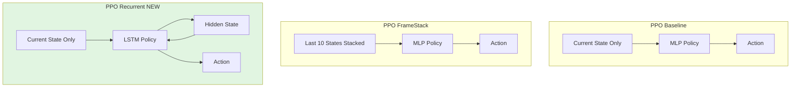

# Add Recurrent PPO Agent Implementation

## Overview

This plan adds a new `ppo_recurrent` agent that uses LSTM-based RecurrentPPO from sb3-contrib. Unlike `ppo_framestack` which stacks observations, this agent maintains internal LSTM state to compress temporal information.

## Key Design Decisions

1. **Observation**: Current state only (adapts to SEIR/SIR based on POMDP wrapper)
2. **LSTM Architecture**: `hidden_size=128`, `n_lstm_layers=1` (smaller network for faster training)
3. **Training Duration**: 100,000 timesteps (2x more than other agents due to LSTM complexity)
4. **Policy**: `MlpLstmPolicy` from sb3-contrib

## Implementation Steps

### 1. Add Dependencies

**File**: `[requirements.txt](requirements.txt)`

Add `sb3-contrib` library:

```
sb3-contrib
```

This provides `RecurrentPPO` and `MlpLstmPolicy` classes.

### 2. Add LSTM Configuration Parameters

**File**: `[src/config.py](src/config.py)`

Add LSTM hyperparameters to `DefaultConfig`:

```python
# Recurrent agent parameters (LSTM)
self.lstm_hidden_size = 128  # Hidden state size for LSTM
self.n_lstm_layers = 1       # Number of LSTM layers
```

These will be used when instantiating `RecurrentPPO`.

### 3. Enable Recurrent Agent in Target List

**File**: `[src/scenarios.py](src/scenarios.py)`

Uncomment `ppo_recurrent` in `TARGET_AGENTS` list:

```python
TARGET_AGENTS = [
    "random",
    "threshold",
    "ppo_baseline",
    "ppo_framestack",
    "ppo_recurrent",  # ← Enable this
]
```

### 4. Implement RecurrentPPO Training Logic

**File**: `[src/train.py](src/train.py)`

Modify `train_ppo_agent()` to handle RecurrentPPO:

**Key changes**:

- Import `RecurrentPPO` from `sb3_contrib.ppo_recurrent`
- Detect when `agent_name == "ppo_recurrent"`
- Use `RecurrentPPO` instead of regular `PPO`
- Use `MlpLstmPolicy` instead of `MlpPolicy`
- Configure LSTM parameters from config
- **Important**: RecurrentPPO requires episode-based rollouts, so use appropriate wrappers

**Code additions**:

```python
from sb3_contrib import RecurrentPPO
```

Inside `train_ppo_agent()`, after line 61 (after Monitor wrapping):

```python
# Handle RecurrentPPO separately
if agent_name == "ppo_recurrent":
    print(f"Using RecurrentPPO with MlpLstmPolicy")
    print(f"LSTM config: hidden_size={config.lstm_hidden_size}, n_layers={config.n_lstm_layers}")
    
    # RecurrentPPO requires special policy kwargs
    policy_kwargs = {
        "lstm_hidden_size": config.lstm_hidden_size,
        "n_lstm_layers": config.n_lstm_layers,
    }
    
    model = RecurrentPPO(
        "MlpLstmPolicy", 
        env, 
        verbose=1,
        policy_kwargs=policy_kwargs,
        tensorboard_log=str(experiment_dir.tensorboard_dir)
    )
    
    # Override total_timesteps for recurrent agent (needs more training)
    recurrent_timesteps = max(total_timesteps, 100000)
    print(f"Training {agent_name} for {recurrent_timesteps} timesteps (recurrent agents need more training)...")
    model.learn(total_timesteps=recurrent_timesteps, tb_log_name=agent_name)
else:
    # Standard PPO model initialization (existing code)
    model = PPO("MlpPolicy", env, verbose=1, tensorboard_log=str(experiment_dir.tensorboard_dir))
    print(f"Training {agent_name} for {total_timesteps} timesteps...")
    model.learn(total_timesteps=total_timesteps, tb_log_name=agent_name)
```

**Note**: RecurrentPPO handles LSTM states automatically during training. No VecEnv is needed.

### 5. Handle RecurrentPPO Evaluation

**File**: `[main.py](main.py)`

Modify `run_evaluation()` function to handle LSTM state properly during evaluation.

**Key consideration**: RecurrentPPO's `predict()` method returns LSTM states that must be passed between steps. The current evaluation logic in `src/evaluation.py` already handles stateful agents via the `state` parameter, but we need to ensure the environment is NOT wrapped in VecFrameStack (recurrent agents use raw observations).

Add handling in `run_evaluation()` around line 205:

```python
# Evaluate RL agents
rl_agent_names = [
    name for name in exp_config.target_agents 
    if name.startswith("ppo_")
]
for model, agent_name in zip(rl_models, rl_agent_names):
    print(f"\nEvaluating {agent_name}...")
    
    # Create appropriate environment for this agent
    if agent_name == "ppo_framestack":
        # FrameStack needs VecFrameStack wrapper
        from stable_baselines3.common.vec_env import DummyVecEnv, VecFrameStack
        eval_env = create_environment(exp_config.base_config, exp_config.pomdp_params)
        eval_env = DummyVecEnv([lambda: eval_env])
        eval_env = VecFrameStack(eval_env, n_stack=exp_config.base_config.n_stack)
    elif agent_name == "ppo_recurrent":
        # Recurrent agent uses raw environment (no stacking, LSTM handles temporal info)
        # Important: RecurrentPPO manages LSTM state internally
        eval_env = create_environment(exp_config.base_config, exp_config.pomdp_params)
    else:
        # Standard environment for baseline PPO
        eval_env = env  # Reuse standard environment
    
    result = run_agent(model, eval_env, experiment_dir=experiment_dir, agent_name=agent_name)
    results.append(result)
```

**Important**: The existing `run_agent()` function in `[src/evaluation.py](src/evaluation.py)` already handles stateful agents correctly by passing the `state` variable through the episode loop. RecurrentPPO's `predict()` method will automatically manage LSTM hidden states.

### 6. Verify LSTM State Handling in Evaluation

**File**: `[src/evaluation.py](src/evaluation.py)` (read-only verification)

Check that the evaluation loop properly handles stateful agents:

```python
# Around lines 50-70 in run_agent()
state = None  # LSTM state for recurrent policies
episode_start = np.ones((1,), dtype=bool)  # Signal episode start

while not done:
    action, state = agent.predict(
        observation, 
        state=state,           # ← LSTM state passed here
        episode_start=episode_start,
        deterministic=True
    )
    episode_start = np.zeros((1,), dtype=bool)  # Only first step is episode start
```

This should already be implemented. Verify it handles the state properly.

## Testing Strategy

### 1. Quick Sanity Check (without training)

```bash
# Verify imports and configuration
python -m py_compile src/train.py src/config.py src/scenarios.py main.py
```

### 2. Test Training (MDP scenario)

```bash
# Train only recurrent agent (skip others to save time)
python main.py --scenario mdp --skip-training ppo_baseline,ppo_framestack --timesteps 10000
```

Expected output:

- RecurrentPPO trains for 100,000 timesteps (override)
- Model saved to `experiments/mdp/weights/ppo_recurrent.zip`
- Learning curve plotted to `plots/ppo_recurrent_learning.png`

### 3. Test Evaluation (load existing weights)

```bash
# Evaluate all agents including recurrent
python main.py --scenario mdp --skip-training all
```

Expected output:

- All agents evaluated, including `ppo_recurrent`
- Comparison plot includes recurrent agent's SEIR curve

### 4. Test POMDP Scenario

```bash
# Test with partial observability (no E compartment)
python main.py --scenario no_exposed --skip-training ppo_baseline,ppo_framestack --timesteps 10000
```

Expected: RecurrentPPO adapts to observation shape [S, I, R] instead of [S, E, I, R].

## Expected Behavior

### Agent Comparison




### Key Differences


| Agent              | Observation                    | Temporal Info            | Parameters |
| ------------------ | ------------------------------ | ------------------------ | ---------- |
| **ppo_baseline**   | Current state (4D or 3D)       | None                     | ~10K       |
| **ppo_framestack** | 10 stacked states (40D or 30D) | Explicit history         | ~15K       |
| **ppo_recurrent**  | Current state (4D or 3D)       | LSTM hidden state (128D) | ~25K       |


### Training Time Comparison

- **ppo_baseline**: 50K timesteps, ~5 min
- **ppo_framestack**: 50K timesteps, ~7 min (larger input)
- **ppo_recurrent**: 100K timesteps, ~15 min (LSTM overhead + more steps)

## Files Modified

1. `[requirements.txt](requirements.txt)` - Add sb3-contrib
2. `[src/config.py](src/config.py)` - Add LSTM hyperparameters
3. `[src/scenarios.py](src/scenarios.py)` - Enable ppo_recurrent in TARGET_AGENTS
4. `[src/train.py](src/train.py)` - Add RecurrentPPO training logic
5. `[main.py](main.py)` - Add recurrent agent evaluation handling

## Potential Issues & Solutions

### Issue 1: RecurrentPPO requires episode-based rollouts

**Solution**: RecurrentPPO automatically handles this. The Monitor wrapper tracks episode boundaries.

### Issue 2: LSTM state dimensionality mismatch

**Solution**: RecurrentPPO automatically initializes LSTM states based on observation space. Our adaptive observation wrapper ensures the space is correctly defined.

### Issue 3: Longer training time

**Solution**: We override `total_timesteps` to 100,000 for recurrent agents to ensure convergence.

### Issue 4: Evaluation with LSTM states

**Solution**: The existing `run_agent()` loop already passes `state` between predictions. RecurrentPPO manages LSTM states internally.

## Future Enhancements

1. **Hyperparameter tuning**: Experiment with different `lstm_hidden_size` (64, 128, 256)
2. **Multi-layer LSTM**: Try `n_lstm_layers=2` for more complex scenarios
3. **Attention mechanism**: Consider using attention-based policies from sb3-contrib
4. **Curriculum learning**: Train recurrent agents on easier scenarios first

## References

- [RecurrentPPO Documentation](https://sb3-contrib.readthedocs.io/en/master/modules/ppo_recurrent.html)
- [MlpLstmPolicy API](https://sb3-contrib.readthedocs.io/en/master/modules/ppo_recurrent.html#sb3_contrib.ppo_recurrent.MlpLstmPolicy)
- Existing implementation patterns in `[src/train.py](src/train.py)` for `ppo_framestack`

